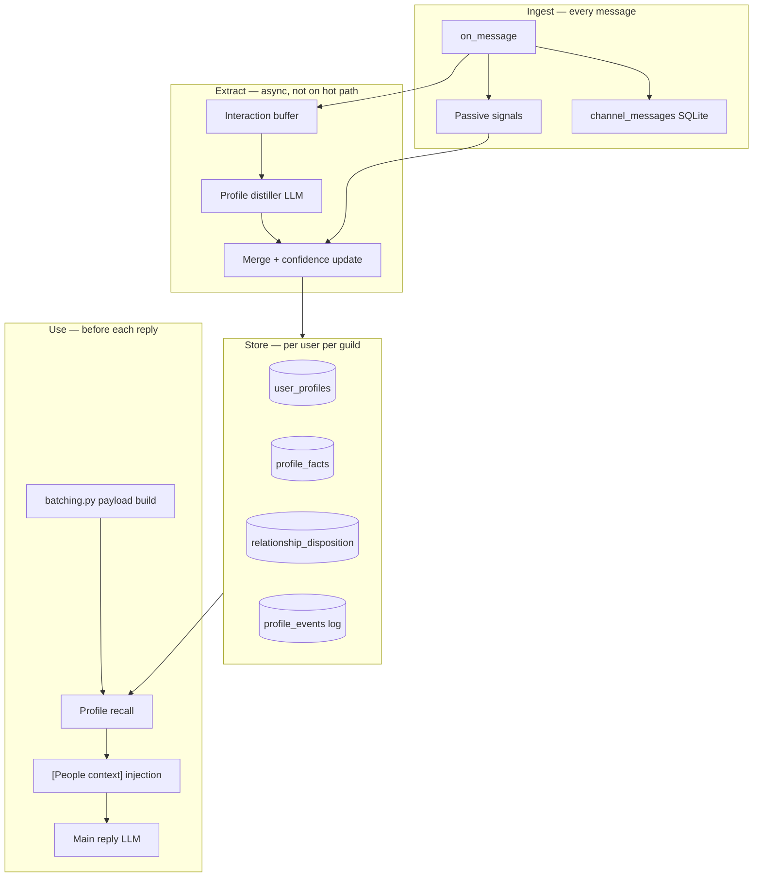

# Dynamic User Profiling — Design Pipeline

A self-contained design for continuously building and updating a structured user model from Discord interactions, then using that evolving profile to personalize Leona's responses and behavior.

**Status:** Implemented (v1.5.0) — Phases A–C; consolidation/outreach polish pending.

---

## Design goal

Split two things that are easy to conflate:

| Layer | What it stores | Example |
|-------|----------------|---------|
| **User model** | Facts and preferences about *them* | "Plays D&D, hates spoilers, Melbourne timezone" |
| **Relationship model** | How *Leona* feels toward *this person* | "Regular, teasing is fine, was grumpy last week, trusts them in DMs" |

Channel memory today (`lib/memory.py`) answers **what was said here**. User profiling answers **who is this person to Leona, and how should she act**.

---

## Architecture overview



**Principle:** passive telemetry is cheap and always on; LLM extraction runs in the background after exchanges, never blocking Discord reply latency.

---

## Identity key

Discord users appear across channels. Key everything by:

```
(account, guild_id, author_id)
```

- **DMs:** `guild_id = ""` (or a sentinel like `"dm"`)
- **Display names:** cache `username`, `display_name`, `nickname` — refresh on each message, never treat nickname as stable identity
- **Cross-channel within a guild:** one profile, many channels (matches how humans remember people, not rooms)

`author_id` is already captured in `store.py` and event payloads — the primitive exists; profiling aggregates on it.

---

## Profile schema (structured, not a blob)

Use a **hybrid**: fixed columns for behavior + JSON facets for semantic facts.

### `user_profiles` (one row per identity key)

| Field | Type | Purpose |
|-------|------|---------|
| `first_seen_at`, `last_seen_at` | timestamp | familiarity |
| `message_count`, `reply_count` | int | how often Leona actually talks to them |
| `avg_message_length` | float | pacing preference |
| `preferred_hour_utc` | int | when they're usually around |
| `topics_positive` | JSON map | topic → score (extend `engagement.py` pattern per-user) |
| `topics_negative` | JSON map | things they've pushed back on |
| `communication_style` | enum | `brief` / `verbose` / `meme-heavy` / `technical` |
| `summary_l1` | text (~150 tokens) | always inject |
| `summary_l2` | text (~300 tokens) | inject when relevant |
| `summary_updated_at` | timestamp | staleness |

### `relationship_disposition` (Leona → user)

Six floats, 0–1, with resting values:

| Dimension | Resting | Meaning |
|-----------|---------|---------|
| `familiarity` | 0.1 | "I know this person" |
| `warmth` | 0.5 | friendly vs distant |
| `trust` | 0.5 | share opinions, tease, be vulnerable |
| `playfulness` | 0.5 | jokes, banter |
| `patience` | 0.7 | tolerance for annoyance / spam |
| `interest` | 0.5 | want to engage vs lurk |

**Disposition updates from two sources:**

1. **Passive deltas** — replied to them (+interest), they replied to Leona's thread (+warmth), they @mention during sleep (+patience test), reaction to Leona's message (+trust), ignored Leona (−interest), etc.
2. **LLM deltas** — small ± adjustments after distilled exchanges (same pattern as Leona's internal mood tracking: tiny deltas per exchange, capped per turn)

"Like/dislike" lives here — not as a boolean, but as drift on dimensions. Dislike ≈ low warmth + low patience + low trust, not a stored insult list.

### `profile_facts` (atomic, evidence-backed)

Each fact is a row, not free text in the summary:

```
id, category, key, value, confidence, source_message_ids[], first_seen, last_confirmed, expires_at?
```

Categories: `preference`, `interest`, `identity`, `boundary`, `in_joke`, `life_event`, `pet_peeve`.

Examples:

- `preference / humor / dry sarcasm / 0.8`
- `boundary / topics / no politics / 0.95`
- `life_event / job / started new role at X / 0.7`

Facts below confidence threshold don't inject. Contradictions lower old confidence instead of deleting (humans update beliefs gradually).

---

## Pipeline stages

### Stage 1 — Passive ingest (sync, every message)

Hook into the path that already runs before batching: `on_message` → `append_message` → gates.

Record per `(account, guild_id, author_id)`:

- timestamps, message length, mention type (reply-to-bot, @mention, organic)
- whether Leona replied (from trace outcomes / reply_handler)
- reaction given/received
- `channel_id` (for "usually talks in #memes")
- outcome: `replied`, `react_only`, `ignored`, `sleep_buffered`

**No LLM.** This feeds disposition deltas and triggers extraction.

### Stage 2 — Interaction buffering

Don't distill every message. Buffer **micro-sessions** per user.

Flush buffer when any of:

- 3+ back-and-forth messages with Leona in a thread
- 15+ minutes idle after user spoke
- User says something explicitly memorable ("remember I hate X")
- `/remember @user …` slash command (natural extension of existing `/remember`)

Store buffer as JSON in SQLite or a `pending_extractions` table.

### Stage 3 — Profile distiller (async LLM)

Secondary call (cheap/fast model), input:

```
- Last N messages involving this user (from channel_messages)
- Current profile summary + top facts
- Current disposition
- Passive signals since last distill
```

Output **strict JSON**:

```json
{
  "facts_add": [{"category":"...", "key":"...", "value":"...", "confidence":0.8}],
  "facts_supersede": [{"id": 12, "reason": "user corrected"}],
  "disposition_delta": {"warmth": 0.02, "trust": -0.01},
  "relationship_note": "They were supportive when Leona was tired.",
  "l1_summary": "Zeebie — regular, technical, prefers short replies...",
  "l2_summary": "..."
}
```

Merge rules:

- Cap disposition deltas per exchange (±0.05)
- New facts need confidence ≥ 0.6 or corroboration
- Regenerate `summary_l1` only when facts change materially (not every distill)

Run via a **scheduled job** (like `quiet_outreach.py`) every 1–5 minutes processing the queue.

### Stage 4 — Consolidation (slow loop)

Nightly or weekly per active user:

- Decay disposition toward resting (absence → familiarity drops slowly, not warmth to zero)
- Expire stale facts (`expires_at` for "working on project X this week")
- Merge duplicate facts
- Prune `profile_events` log

Optional: regenerate `summary_l2` from facts + recent events.

### Stage 5 — Recall & inject (sync, hot path)

Add a sibling to `memory.recall_context()` — e.g. `profile.recall_user_context(account, guild_id, author_id, query)` — called from `batching.py` **after** channel memory, **before** style hints.

Injection tiers:

| Tier | When | Content |
|------|------|---------|
| **L0** | Always if `message_count > 0` | One line: "Speaking with **Zeebie** (regular here, casual tone OK)." |
| **L1** | Always for known users | `summary_l1` + disposition phrases ("warm, playful") |
| **L2** | Query-relevant | Top 3–5 facts matching current message keywords |
| **L3** | Rare | Full `summary_l2` for DMs or `@mention` |

Format (internal, not for display):

```
[People context — internal]
User: Zeebie (@zeebie, familiar regular)
Disposition: warm, playful, high trust
Known: prefers concise replies; into D&D and Linux; Melbourne
Note: Last spoke 2 days ago — a light callback is fine.
```

**Token budget:** mirror `memory_max_tokens` — e.g. 200–400 tokens default, server-overridable in plugin settings.

### Stage 6 — Behavior modulation (optional but high ROI)

Disposition shouldn't only be text — wire it into existing Leona systems:

| System | Modulation |
|--------|------------|
| `gates.py` / reply chance | `interest` scales `human_response_chance` for this author |
| `engagement.py` | per-user topic scores, not just per-channel |
| `reactions.py` | warmer users → softer emoji set |
| `style_hint.py` | "close friend" vs "first interaction" framing |
| `outreach_llm.py` / `quiet_outreach` | prioritize checking in on high-familiarity absent users |

This makes profiling *felt*, not just read.

---

## Multi-user Discord specifics

1. **Per-guild profiles** — same Discord user can be different in different servers; don't global-merge unless an explicit opt-in "global user" scope is added later.

2. **Group context** — when several people are chatting, inject **only the trigger author's** profile (from `author_id` in the batch). Optionally a one-liner for others active in the last N messages: "Also present: Alice (occasional), Bob (new)."

3. **Privacy / consent**
   - Settings: `profiling_enabled`, `profiling_dm_only`, `profiling_min_messages` (e.g. 5 before any extraction)
   - `/forget-me` slash command — wipe row + facts
   - Never inject one user's private DM facts into a guild channel

4. **Imperfect recall mode** (see Roadmap) — ~5% omit a fact or phrase uncertainly: "I think you mentioned…" — applies to profile facts too.

---

## Suggested implementation phases

**Phase A — Skeleton (highest ROI, matches Roadmap #1)**

- `user_profiles` table + passive counters
- L0/L1 injection in `batching.py`
- No LLM yet — just "regular / new / last seen"

**Phase B — Disposition + passive deltas**

- Reply/reaction/ignore signals update floats
- Modulate reply chance per author

**Phase C — LLM distiller + facts table**

- Buffer, async extract, `/remember @user`
- L2 keyword recall

**Phase D — Consolidation + outreach**

- Decay, weekly summary regen, "absent regular" check-ins

**Phase E — Polish**

- Imperfect recall, UI dashboard, cross-channel "you said in #dev yesterday" (with privacy toggle)

---

## Example end-to-end

1. Zeebie posts in `#general`: "finally fixed that sleep schedule bug"
2. Passive: `message_count++`, topic `sleep` +, `last_seen_at` updated
3. Leona replies; passive: `reply_count++`, `interest += 0.02`
4. Buffer flushes after 10 min idle → distiller adds fact `interest/coding/sapphire plugins/0.75`, bumps `trust`
5. Next day Zeebie mentions "Leona" without @ — gates use higher `interest` for Zeebie; injection includes L1 summary + "they were happy about the sleep fix yesterday"

---

## Design choices to decide upfront

1. **Leona's feelings vs user facts** — keep separate tables so you can wipe facts without wiping relationship history.
2. **Extraction model** — same provider as main chat vs dedicated cheap model (recommend cheap; runs often).
3. **Guild vs global** — default guild-scoped for Discord norms.
4. **Explicit vs implicit memory** — `/remember` writes high-confidence facts immediately; distiller handles implicit.
5. **Bot accounts** — skip profiling for `author.bot` except maybe "friendly bot, don't engage deeply."

---

## Fit with existing Leona code

The Roadmap already points at the right seams:

| Existing piece | Role in profiling |
|----------------|-------------------|
| `lib/store.py` | Add per-user tables alongside `channel_messages` |
| `lib/memory.py` | Channel recall stays separate; add `lib/profile.py` for people recall |
| `lib/batching.py` | Inject profile context next to `build_style_hint()` and `memory.recall_context()` |
| `lib/engagement.py` | Extend topic/interest tracking from per-channel to per-user |
| `schedule/` | Host distiller queue + consolidation cron jobs |

The main addition beyond Roadmap item #1 (per-user relationship memory) is the **async distiller loop** and the **disposition model** — that's what turns "remember messages" into "know and like/dislike people."

---

## Related

- `Roadmap.md` — item #1 (per-user relationship memory), item #10 (imperfect recall)
- `lib/memory.py` — channel-centric recall (complementary, not replaced)
- `configuration_guide.md` — settings surface for `profiling_*` toggles when implemented
